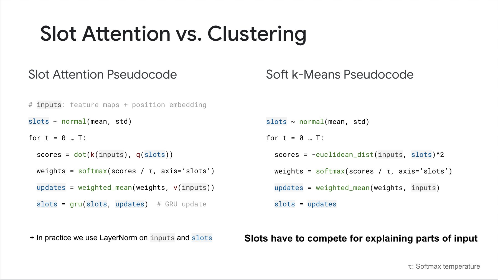

</img>

## Slot Attention

Implementation of <a href="https://arxiv.org/abs/2006.15055">Slot Attention</a> from the paper 'Object-Centric Learning with Slot Attention' in Pytorch. Here is a <a href="https://www.youtube.com/watch?v=DYBmD88vpiA">video</a> that describes what this network can do.

## Install

```bash
$ pip install slot_attention
```

## Usage

```python
import torch
from slot_attention import SlotAttention

slot_attn = SlotAttention(
    num_slots = 5,
    dim = 512,
    iters = 3   # iterations of attention, defaults to 3
)

inputs = torch.randn(2, 1024, 512)
slot_attn(inputs) # (2, 5, 512)
```

After training, the network is reported to be able to generalize to slightly different number of slots (clusters). You can override the number of slots used by the `num_slots` keyword in forward.

```python
slot_attn(inputs, num_slots = 8) # (2, 8, 512)
```

## Citation

```bibtex
@misc{locatello2020objectcentric,
    title = {Object-Centric Learning with Slot Attention},
    author = {Francesco Locatello and Dirk Weissenborn and Thomas Unterthiner and Aravindh Mahendran and Georg Heigold and Jakob Uszkoreit and Alexey Dosovitskiy and Thomas Kipf},
    year = {2020},
    eprint = {2006.15055},
    archivePrefix = {arXiv},
    primaryClass = {cs.LG}
}
```
